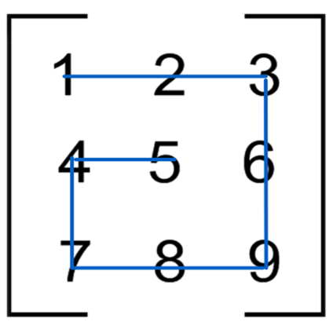
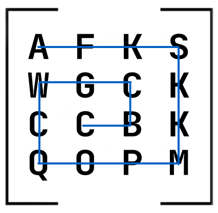

Матрицу в python можно представить в виде двумерного списка. Например, квадратная матрица вида:
```
1 2 3
4 5 6
7 8 9
```
представляется вот так: `[[1, 2, 3], [4, 5, 6], [7, 8, 9]]`. 


## src/solution.py

Реализуйте функцию `snail`, которая принимает на вход квадратную матрицу в виде двумерного списка и возвращает список элементов матрицы по порядку следования от левого верхнего элемента по часовой стрелке к внутреннему. Вид движения по матрице напоминает улитку:

 

Для первой картинки результат работы функции должен быть таким:
`[1, 2, 3, 6, 9, 8, 7, 4, 5]`

Для второй:
`['A', 'F', 'K', 'S', 'K', 'K', 'M', 'P', 'O', 'Q', 'C', 'W', 'G', 'C', 'B', 'C']`

## Примеры использования:
```
>>> snail([[1, 2], [3, 4]])
[1, 2, 4, 3]
>>> snail([[1, 2, 3], [8, 9, 4], [7, 6, 5]])
[1, 2, 3, 4, 5, 6, 7, 8, 9]
>>> snail([['b', 'c', 'a'], ['3', True, 11], [None, 'foo', 0]])
['b', 'c', 'a', 11, 0, 'foo', None, '3', True]
>>> snail([[]])
[]
```
